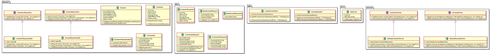

== Test Banking application using Hexagonal Architecture

== Running application

Makefile was created to run the application. The following commands are available:

```bash
make run
```

Following a Tutorial on Hexagonal architecture using golang

== Creating Initial Application

.Overview Of initial design


1. Start at the Domain (domain.customer) and create interface
2. Introduce the "CustomerRepository interface" (Since this is on the boundary of the doamin this will be created in the same file as the domain.
3. Introduce the Adaptor (Stub) "CustomerRepository"
4. Create the Service Port ("CustomerService interface") + Default implementation
5. Create a Customer Hndler with a Customer Service
6. Finally wire up application in app.go (Define Handler with service aand adaptor)

=== Testing

```bash
curl --location --request GET 'localhost:8080/customers' \
--header 'Content-Type: application/xml'

curl --location --request GET 'localhost:8080/customers' \
--header 'Content-Type: application/json' | jq

curl --location --request POST 'localhost:8000 /customer/2001/account' \
--header 'Content-Type: application/xml' \
--data-raw '{
    "account_type": "saving",
    "amount": 5000.23
}'
```

== Diagrams with PlantUML

.UML Diagram


=== Install pre-requisites

Install goplantuml:
```
go get github.com/jfeliu007/goplantuml/parser
go get github.com/jfeliu007/goplantuml/cmd/goplantuml
pushd $GOPATH/src/github.com/jfeliu007/goplantuml
go install ./...
popd
```

Install plantuml for MAC:
```
brew install plantuml
```

== REFERENCE MATERIAL

.Hexagonal Architecture
 - https://www.udemy.com/course/rest-based-microservices-api-development-in-go-lang/
 - https://medium.com/@iDevoid/stygis-golang-hexagonal-architecture-a2d89d01f84b
 - https://github.com/iDevoid/stygis
 - https://threedots.tech/post/introducing-clean-architecture/
 - https://medium.com/@matiasvarela/hexagonal-architecture-in-go-cfd4e436faa3
 - https://docs.google.com/drawings/d/1q75-yq7l8cNhTgG2EcqftayQMeS8drAdtyP3OgzFe7Y/edit
 
.PlantUML for GoCode
 - https://github.com/jfeliu007/goplantuml
 